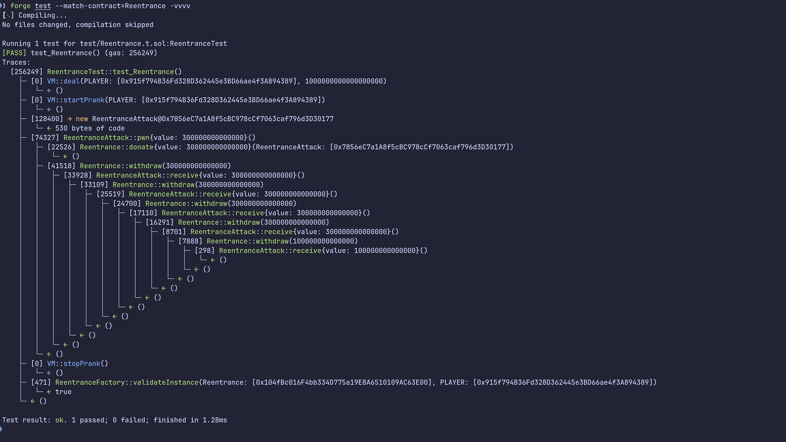

<!-- PROJECT LOGO -->
<br />
<div align="center">
  <a href="https://ethernaut.openzeppelin.com/">
    
  </a>
  <h3 align="center">ethernaut-foundry</h3>

  <p align="center">
    This is an <a href="https://ethernaut.openzeppelin.com/">Ethernaut</a> challenge solution written with <a href="https://github.com/foundry-rs/foundry">Foundry</a>
  </p>
  <p align="center">
    Test and verify as you wish!
  </p>
</div>


<!-- ABOUT THE PROJECT -->
## Description



This is a Foundry's forge-based Ethernaut challenge solution. The code is written using the [Forge Standard Library](https://github.com/foundry-rs/forge-std) and you can test and validate the attack transactions as you wish.


### Notes

Since each challenge has a different solidity version, instead of deploying the ethernaut contract, we implemented it by creating and validating challenge instances directly through each challenge factory contract. The following two challenges have exceptions:

- [AlienCodex](test/AlienCodex.t.sol)
  <details>
    <summary>Spoiler warning</summary>
      Since this challenge does not compile in solidity version 0.6 or later, I loaded the bytecode compiled in version 0.5 directly into memory and created an instance using the create opcode.
  </details>
- [Motorbike](test/Motorbike.t.sol)
   <details>
    <summary>Spoiler warning</summary>
      The challenge is to verify that the contract instance is self-destructed, which is impossible to verify with a forge test because code deletion occurs after the transaction. Therefore, verified it by checking the balance.
   </details>


<!-- GETTING STARTED -->
## Getting Started

### Prerequisites

Before we get started, you'll need to install foundry.

```
curl -L https://foundry.paradigm.xyz | bash
```

Then, in a new terminal run: `foundryup`. Now you can use forge command-line tool!

### Directory Structure
```
├── lib
│   ├── forge-std
│   ├── openzeppelin-contracts
│   └── openzeppelin-contracts-solc-0.6
├── src
│   ├── levels
│   │   ├── Reentrance.sol
│   │   └── ReentranceFactory.sol
│   └── attacks
│       └── ReentranceAttack.sol
└── test
    └── Reentrance.t.sol
```

Using the Reentrance challenge as an example, the `src` directory contains `Reentrance.sol`, the challenge contract, and `ReentranceFactory.sol`, which creates challenge instances and validates the results. The test directory contains the `Reentrance.t.sol` file, which contains the test code to perform the attack and request validation. Finally, if you need a separate contract deployment for challenge solving, it exists under the `attacks` directory.

### Usage

All test contracts are named `<Challenge>Test` (for example, `ReentranceTest`) and the test function is named `test_Challenge()`(e.g. `test_Reentrance()`)

If you want to test the `Reentrance`, you can do the following:

```
forge test --match-contract=Reentrance -vvvv
```

You can check emiited logs and stack traces during test. Further information, see [Foundry Book](https://book.getfoundry.sh/)

## List of Challenges

1. [Fallback](test/Fallback.t.sol)
2. [Fallout](test/Fallout.t.sol)
3. [Coin Flip](test/CoinFlip.t.sol)
4. [Telephone](test/Telephone.t.sol)
5. [Token](test/Token.t.sol)
6. [Delegation](test/Delegation.t.sol)
7. [Force](test/Force.t.sol)
8. [Vault](test/Vault.t.sol)
9. [King](test/King.t.sol)
10. [Re-entrancy](test/Reentrance.t.sol)
11. [Elevator](test/Elevator.t.sol)
12. [Privacy](test/Privacy.t.sol)
13. [Gatekeeper One](test/GatekeeperOne.t.sol)
14. [Gatekeeper Two](test/GatekeeperTwo.t.sol)
15. [Naught Coin](test/NaughtCoin.t.sol)
16. [Preservation](test/Preservation.t.sol)
17. [Recovery](test/Recovery.t.sol)
18. [MagicNumber](test/MagicNumber.t.sol)
19. [Alien Codex](test/AlienCodex.t.sol)
20. [Denial](test/Denial.t.sol)
21. [Shop](test/Shop.t.sol)
22. [Dex](test/Dex.t.sol)
23. [Dex Two](test/DexTwo.t.sol)
24. [Puzzle Wallet](test/PuzzleWallet.t.sol)
25. [Motorbike](test/Motorbike.t.sol)
26. ~~DoubleEntryPoint~~
27. [Good Samaritan](test/GoodSamaritan.t.sol)
28. [Gatekeeper Three](test/GatekeeperThree.t.sol)


## Acknowledgments

* [@ciaranmcveigh5/ethernaut-x-foundry](https://github.com/ciaranmcveigh5/ethernaut-x-foundry)
